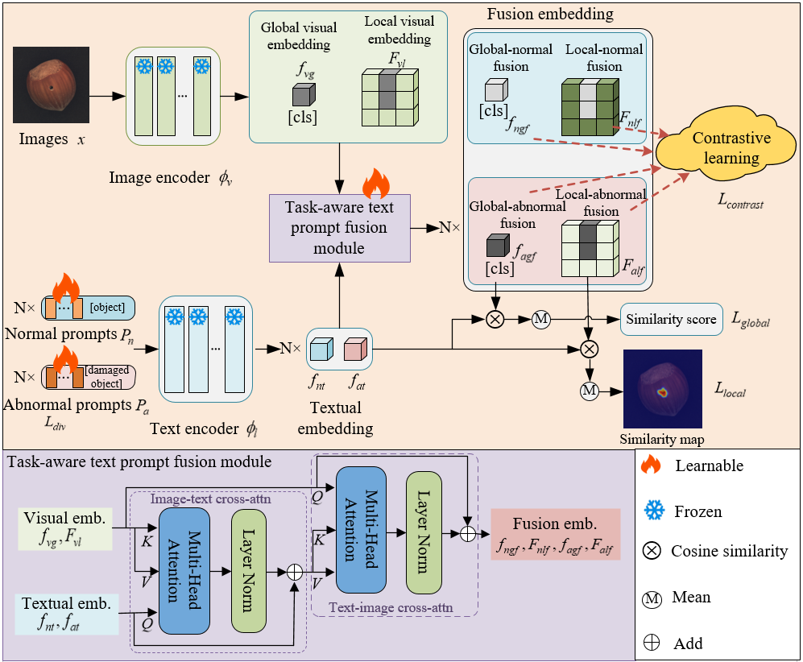

## Task-aware text prompt fusion with contrastive learning for zero-shot anomaly detection

## Highlights


> **<p align="justify"> Abstract:** Recently, vision-language pre-trained models, such as CLIP, have demon-
strated significant potential in zero-shot anomaly detection. Current research primarily focuses on adapting CLIP for anomaly detection through
either prompt learning or adapter. However, the original CLIP encoder produces anomaly-unawareness features due to pretraining on generic image-text
pairs and lacking explicit guidance for anomaly detection tasks. To address
this limitation, we introduce task-specific supervisory signals into the feature learning process. The core idea of our method is to leverage normal
text prompts to enhance normal information in images while suppressing
anomalous, whereas anomalous text prompts are designed to amplify abnormal features and diminish normal signals. Compared to directly extracting
image features from a frozen visual encoder, such task-aware text-prompted
image features are more adaptive to anomaly detection, thereby facilitating
more effective prompt learning. 

## Datasets Download:
Put the datasets in `./data` folder.

### [VisA](https://amazon-visual-anomaly.s3.us-west-2.amazonaws.com/VisA_20220922.tar)

```
data
|----visa
|-----|-- split_csv
|-----|-----|--- 1cls.csv
|-----|-----|--- 2cls_fewshot.csv
|-----|-----|--- ......
|-----|-- candle
|-----|-----|--- Data
|-----|-----|-----|----- Images
|-----|-----|-----|--------|------ Anomaly 
|-----|-----|-----|--------|------ Normal 
|-----|-----|-----|----- Masks
|-----|-----|-----|--------|------ Anomaly 
|-----|-----|--- image_anno.csv
|-----|-- capsules
|-----|--- ...
```


## How to Run

The script `train.py` and `test.py` provides a simple illustration. For example, you can use the following command:

```
python train.py
python test.py
```


